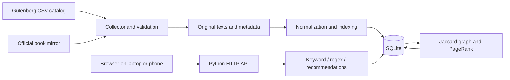

# Algorithm and architecture notes

These describe the implemented choices. Compare them with Lectures 1 and 3 before
finalizing the report: the assignment refers to those definitions, but those
lecture documents are not present in this workspace.

## Architecture

Offline work: collection, index creation, graph construction and centrality.
Online work: vocabulary matching, postings aggregation, result sorting,
recommendation lookup and pagination.

## Text and inverted index

Normalize to NFC and case-fold, normalize curly apostrophes, then tokenize Unicode
letter sequences with optional internal apostrophes. Digits and underscores are
not indexed. No stemming and no stopword removal are performed. This preserves
exact normalized word search and keeps the Jaccard definition transparent.
Book length is the number of these tokens, not file size or vocabulary size.

`terms(id, word)` provides a unique dictionary. `postings(term_id, book_id, count)`
records occurrences. For example, "sea sea ocean" creates sea→2 and ocean→1.
SQLite B-tree indexes support term and postings lookup. Import is atomic per book.
Collecting all counts takes O(T) expected time for T tokens, excluding database
insertion costs. Posting storage is proportional to distinct term/book pairs.

Keyword search retrieves one normalized word; it does not scan whole books. Regex
search matches the vocabulary once and sums postings for the matching terms.
Summing counts means a query `sea|ocean` ranks frequency using both words together.

## Regex: Thompson NFA

Recursive descent parses union, concatenation and quantifiers. The compiler
creates character, wildcard, class, epsilon-split and accepting states. Fragments
carry unresolved transitions, which are patched during concatenation and closure.

The matcher computes an epsilon closure, consumes a character by following all
matching transitions, and closes again. Acceptance requires an accepting state
after the **entire indexed word** has been consumed. Cycles in epsilon transitions
are tracked with a visited set. No exponential backtracking is used.

For m states and a word of length L: O(mL) time and O(m) active-state memory.
Vocabulary search costs O(m times the total characters in the vocabulary), plus
postings aggregation. Expressions are limited to 128 characters. A query has an
eight-second vocabulary-scan budget checked between words; this is not a hard
real-time deadline. HTTP search concurrency is limited to two active requests.

Supported: literals, `.`, `|`, grouping, `*`, `+`, `?`, classes/ranges/negation,
escaped punctuation. Unsupported syntax is rejected instead of silently claiming
full Python/PCRE compatibility. The NFA tests compare supported expressions with
Python `re.fullmatch` over an exhaustive small word set, and exercise a nested
quantifier that causes pathological behavior in backtracking engines.

## Jaccard graph

For books represented by sets A and B of all their normalized indexed words:

J(A,B) = |A intersection B| / |A union B|; distance d(A,B) = 1 - J(A,B).

An undirected edge exists iff J(A,B) >= threshold (default 0.30). Equivalently,
d(A,B) <= 0.70. This threshold is a provisional implementation choice, not a course
requirement: evaluate multiple values and justify your final value using graph
density and recommendation relevance. Similarity is stored on each edge.

Each vocabulary term is assigned a bit; each book becomes an integer bitset.
Intersection size is `bit_count(bits_a & bits_b)` and union size follows from the
two set sizes. This computes **exact** Jaccard, not an approximate top-term sketch.
For N books and V vocabulary terms, all-pairs comparison is roughly O(N² V/w)
machine-word operations, and bitsets use O(NV/w) words. Stored edges can be O(N²).
Keeping all common words may inflate similarities; compare that limitation with
stopword-filtered representations in the report rather than changing definitions
without documenting it.

On the initial 12-book development corpus, thresholds .15/.20/.25/.30/.35
produce 65/59/45/31/9 edges respectively (out of 66 possible). The default .30
avoids the almost-complete graph observed at .15. This is development evidence,
not proof of the optimal threshold on the full corpus.

Hand-check fixture:

- A = {sea, ocean, adventure}
- B = {sea, ocean, voyage}
- C = {ocean, voyage, ship}
- D = {forest, tree, green}

J(A,B)=1/2, J(B,C)=1/2, J(A,C)=1/5; D has no shared words. At threshold .4 the graph
is A—B—C plus isolated D. Tests verify these exact edges.

## PageRank

The graph is undirected and **unweighted for centrality**; edge similarities are
used for recommendations. With damping alpha=.85 and N nodes:

PR_next(v) = (1-alpha)/N + alpha * dangling_mass/N
             + alpha * sum(PR(u)/degree(u) for u adjacent to v).

Start uniformly at 1/N. Redistribute isolated-node probability uniformly.
Stop when the L1 difference between consecutive vectors is below 1e-10, with
a 200-iteration cap; nonconvergence is reported. One iteration is O(N+E).
Scores sum to approximately 1, including disconnected graphs.

In a three-node star without isolates, the center score is .9/1.85 ≈ .486486;
each leaf has ≈ .256757. The test verifies this independently derived solution.
The report must additionally show examples using actual corpus books.

Search sorts matching books by decreasing global PageRank, then occurrence count,
then ID for deterministic ties. The alternative frequency view reverses the first
two criteria. A central book is not necessarily the most semantically relevant:
this is a hypothesis to evaluate, not a claim of perfect ranking.

## Recommendations

Take the three highest-ranked matching books and traverse their graph neighbors.
Exclude every book matching the original query. For each candidate retain its
largest Jaccard similarity to these three seeds. Return up to six candidates,
sorted by similarity and then ID. No click tracking or personal data is required.

Broad queries can match the entire corpus and legitimately yield no recommendations.

## References to consult and cite

- Course lectures 1 and 3: primary source for the assignment's formal definitions.
- Ken Thompson, "Programming Techniques: Regular Expression Search Algorithm",
  Communications of the ACM, 11(6), 1968, pp. 419–422.
- Lawrence Page, Sergey Brin, Rajeev Motwani, Terry Winograd, "The PageRank Citation
  Ranking: Bringing Order to the Web", Stanford technical report, 1999.
- Project Gutenberg catalog: https://www.gutenberg.org/ebooks/offline_catalogs.html
- Download guidance: https://www.gutenberg.org/policy/robot_access.html

Read the references and verify bibliographic details before using them in the final
report. This file explains the code; it is not the required literature review.
